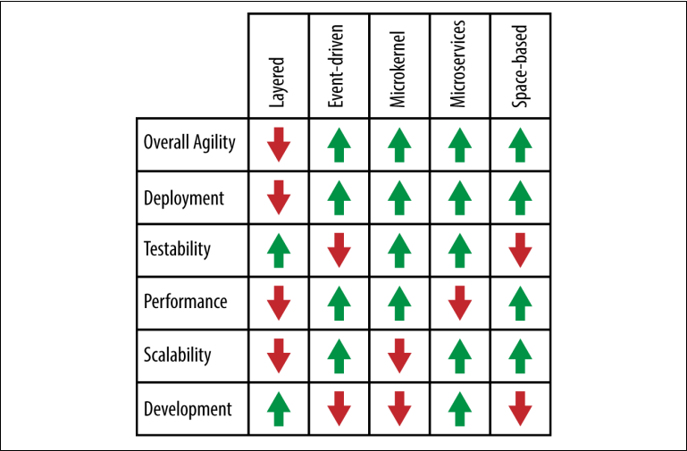

### APPENDIX A

# 패턴 분석 요약

그림 A-1은 이 보고서에 기술된 각 아키텍처 패턴에 대한 패턴 분석 점수를 요약한다. 이 요약은 어떤 패턴이 당신의 상황에 가장 적합한지 결정하는 데 도움이 될 것이다. 예를 들어, 주요 아키텍처 문제가 확장성인 경우 이 차트를 통해 이벤트 중심 패턴, 마이크로서비스 패턴 및 공간 기반 패턴이 아마도 우수한 아키텍처 패턴 선택임을 확인할 수 있다. 마찬가지로, 애플리케이션에 대해 계층화된 아키텍처 패턴을 선택하는 경우, 차트를 참조하여 배포, 성능 및 확장성이 아키텍처의 위험 영역일 수 있음을 확인할 수 있다.

 

_그림 A-1. 패턴 분석 요약_

이 차트는 여러분이 올바른 패턴을 선택하는데 도움을 줄 것이지만, 건축 패턴을 선택할 때 고려해야 할 훨씬 더 많은 것들이 있다. 인프라 지원, 개발자 스킬 세트, 프로젝트 예산, 프로젝트 마감일, 애플리케이션 크기(몇 가지 이름) 등 환경의 모든 측면을 분석해야 한다. 올바른 건축 패턴을 선택하는 것은 매우 중요하다. 왜냐하면 일단 구조가 자리를 잡으면, 바꾸는 것은 매우 어렵고 비용이 많이 들기 때문이다.
