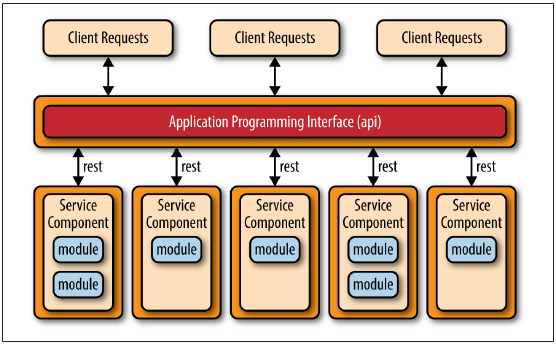
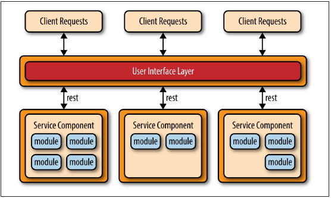
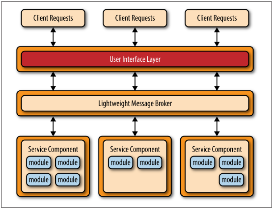

## CHAPTER 4 
# 마이크로서비스 아키텍처 패턴

마이크로서비스 아키텍처 패턴은 단일 애플리케이션과 서비스 지향 아키텍처에 대한 실행 가능한 대안으로서 업계에서 빠르게 입지를 굳히고 있다. 이 아키텍처 패턴은 여전히 진화하고 있기 때문에, 업계에서는 이 패턴이 무엇이며 어떻게 구현되는지에 대해 많은 혼란이 일어나고 있다. 이 보고서의 섹션은 당신에게 이 중요한 아키텍처 패턴의 이점(및 절충)과 그것이 당신의 애플리케이션에 적합한 패턴인지를 이해하는 데 필요한 핵심 개념과 기초 지식을 제공할 것이다.

## 패턴 설명
선택한 토폴로지 또는 구현 스타일에 관계없이 일반 아키텍처 패턴에 적용되는 몇 가지 공통 핵심 개념이 있다. 이러한 개념들 중 첫 번째는 별도로 배치된 단위의 개념이다. 그림 4-1에서와 같이 마이크로서비스 아키텍처의 각 구성요소는 별도의 단위로 배치되어 효율적이고 간소화된 제공 파이프라인을 통해 더 쉽게 구현할 수 있으며, 확장성이 향상되며, 애플리케이션 내에서 높은 수준의 애플리케이션 및 구성요소 디커플링을 수행할 수 있다.

아마도 이 패턴으로 이해해야 할 가장 중요한 개념은 서비스 구성요소의 개념일 것이다. 마이크로서비스 아키텍처 내의 서비스에 대해 생각하기 보다는, 단일 모듈에서 애플리케이션의 많은 부분에 이르기까지 세분화할 수 있는 서비스 구성요소에 대해 생각하는 것이 좋다. 서비스 구성요소에는 단일 목적 기능(예: 특정 도시나 읍의 날씨 제공) 또는 대규모 비즈니스 애플리케이션의 독립적 부분(예: 주식 거래 배치 또는 자동 보험 결정)을 나타내는 하나 이상의 모듈(예: Java 클래스)이 포함되어 있다.

 비율 적절한 수준의 서비스 구성요소 세분화를 설계하는 것은 마이크로서비스 아키텍처 내에서 가장 큰 과제 중 하나이다.
 이 과제는 다음 서비스 구성요소 조정 하위 섹션에서 자세히 설명된다.
 
 
*Figure 4-1. 기본 마이크로서비스 아키텍처 패턴*

마이크로서비스 아키텍처 패턴 내의 또 다른 핵심 개념은 분산형 아키텍처라는 것인데, 이는 아키텍처 내의 모든 구성요소가 서로 완전히 분리되어 어떤 종류의 원격 액세스 프로토콜(예: JMS, AMQP, REST, SOAP, RMI 등)을 통해 접속된다는 것을 의미한다. 이 아키텍처 패턴의 분산 특성은 우수한 확장성과 구축 특성을 어떻게 달성하느냐 이다.

마이크로서비스 아키텍처의 흥미로운 점 중 하나는 그것이 문제가 발생하기를 기다리는 솔루션으로 만들어지기 보다는 다른 일반적인 아키텍처 패턴과 관련된 이슈로부터 진화했다는 것이다. 마이크로서비스 아키텍처 스타일은 계층형 아키텍처 패턴을 사용하여 개발된 단일 애플리케이션과 서비스 지향 아키텍처 패턴을 통해 개발된 분산 애플리케이션이라는 두 가지 주요 소스로부터 자연스럽게 진화되었다.

단일 애플리케이션에서 마이크로서비스 아키텍처 스타일로의 진화적인 경로는 주로 애플리케이션의 배치를 간소화하는 개발에서 생산에 이르는 지속적인 구축 파이프라인의 개념인 지속적인 제공의 개발을 통해 촉진되었다. 단일형 애플리케이션은 일반적으로 단일 구축 가능 유닛의 일부인 긴밀하게 결합된 구성요소로 구성되어 있어 애플리케이션을 변경, 테스트 및 구현하는 것이 번거롭고 어렵다(대부분의 대형 IT 샵에서 흔히 볼 수 있는 "월별 구축" 주기의 증가를 의미한다). 이러한 요인들은 일반적으로 새로운 것이 배치될 때마다 깨지기 쉬운 애플리케이션으로 이어진다. 마이크로서비스 아키텍처 패턴은 애플리케이션을 다른 서비스 구성요소와 독립적으로 개별적으로 개발, 테스트 및 구현할 수 있는 다중 구축 가능 장치(서비스 구성요소)로 분리함으로써 이러한 문제를 해결한다.

마이크로서비스 아키텍처 패턴으로 이어지는 또 다른 진화 경로는 서비스 지향 아키텍처 패턴(SOA)을 구현하는 애플리케이션에서 발견된 문제에서 비롯된다. SOA 패턴은 매우 강력하며 추상화, 이기종 연결, 서비스 조정, 비즈니스 목표와 IT 기능을 일치시키겠다는 약속 등을 비교할 수 없는 수준으로 제공하지만, 그럼에도 불구하고 복잡하고, 비용이 많이 들고, 유비쿼터스하며, 이해와 구현이 어려우며, 대부분의 애플리케이션에서 대개 지나치게 활용된다. 마이크로서비스 아키텍처 스타일은 서비스의 개념을 단순화하고, 조정 필요성을 제거하며, 서비스 구성요소에 대한 연결과 접근을 단순화함으로써 이러한 복잡성을 해결한다.

## 패턴 토폴로지
마이크로서비스 아키텍처 패턴을 구현하는 방법은 문자 그대로 수십 가지지만, API REST 기반 토폴로지, 애플리케이션 REST 기반 토폴로지, 중앙집중식 메시징 토폴로지의 세 가지 주요 토폴로지가 가장 보편적이고 인기 있는 것으로 두드러진다.

API REST 기반 토폴로지는 일종의 API(응용프로그램 프로그래밍 인터페이스)를 통해 소규모의 자급식 개별 서비스를 노출시키는 웹사이트에 유용하다. 이 토폴로지는 그림 4-2에 나와 있으며, 나머지 서비스와는 독립적으로 특정 비즈니스 기능을 수행하는 모듈이 한 개 또는 두 개 들어 있는 매우 세분화된 서비스 구성요소(이름 마이크로서비스)로 구성되어 있다. 이 토폴로지에서는 이러한 세분화된 서비스 구성요소는 일반적으로 별도로 배포된 웹 기반 API 계층을 통해 구현된 REST 기반 인터페이스를 사용하여 액세스한다.

 이 토폴로지의 예로는 야후, 구글, 아마존이 공통적으로 발견하는 단일 목적 클라우드 기반 RESTful 웹 서비스의 일부가 있다.

 
*그림 4-2 API REST 기반 토폴로지*

애플리케이션 REST 기반 토폴로지는 클라이언트 요청이 단순한 API 계층이 아닌 전통적인 웹 기반 또는 지방 클라이언트 비즈니스 애플리케이션 화면을 통해 수신된다는 점에서 API REST 기반 접근방식과 다르다. 그림 4-3과 같이, 애플리케이션의 사용자 인터페이스 계층은 단순한 REST 기반 인터페이스를 통해 별도로 구축된 서비스 구성요소(비즈니스 기능성)에 원격으로 접속하는 별도의 웹 애플리케이션으로 구축된다.

 이 토폴로지의 서비스 구성요소는 이러한 서비스 구성요소가 세분화된 단일 작용 서비스보다는 더 크고, 더 조잡하며, 전체 비즈니스 애플리케이션의 작은 부분을 나타내는 경향이 있다는 점에서 API-REST 기반 토폴로지의 그것들과 다르다. 이 토폴로지는 비교적 복잡성이 낮은 중소기업 애플리케이션에 공통적이다.

 
*그림 4-3 애플리케이션 REST 기반 토폴로지*

마이크로서비스 아키텍처 패턴 내의 또 다른 일반적인 접근방식은 중앙 집중식 메시징 토폴로지다. 이 토폴로지(그림 4-4에 제시됨)는 원격 액세스에 REST를 사용하는 대신 가벼운 중앙 집중식 메시지 브로커(예: ActiveMQ, HornetQ 등)를 사용한다는 점을 제외하면 애플리케이션 REST 기반 토폴로지와 유사하다. 이 토폴로지를 서비스 지향 아키텍처 패턴과 혼동하거나 "SOA-Lite"로 간주하지 않는 것이 매우 중요하다. 이 토폴로지에서 발견된 경량 메시지 브로커는 어떠한 조정, 변환 또는 복잡한 라우팅도 수행하지 않는다. 오히려 원격 서비스 구성요소에 액세스하는 것은 경량 전송일 뿐이다.

중앙 집중식 메시징 토폴로지는 일반적으로 사용자 인터페이스와 서비스 구성요소 사이의 전송 계층에 대한 보다 정교한 제어가 필요한 대규모 비즈니스 애플리케이션 또는 애플리케이션에서 발견된다. 앞에서 설명한 간단한 REST 기반 토폴로지에 비해 이 토폴로지의 이점은 고급 대기열 메커니즘, 비동기 메시징, 모니터링, 오류 처리 및 향상된 전체 로드 밸런싱 및 확장성이다. 일반적으로 중앙 집중식 브로커와 관련된 단일 장애 지점 및 구조적 병목 현안은 브로커 클러스터링 및 브로커 연합(단일 브로커 인스턴스를 복수의 브로커 인스턴스로 분할하여 시스템의 기능 영역에 기반한 메시지 처리량 로드를 분할)을 통해 해결된다.
 

*그림 4-4 중앙 집중식 메시징 토폴로지*

## 종속성 및 조정 방지
마이크로서비스 아키텍처 패턴의 주요 과제 중 하나는 서비스 구성요소에 대한 정확한 세분화 수준을 결정하는 것이다.

 서비스 구성요소가 너무 조잡할 경우, 이 아키텍처 패턴(배포, 확장성, 테스트 가능성 및 느슨한 결합)과 함께 제공되는 이점을 깨닫지 못할 수 있다. 그러나 너무 세분화된 서비스 구성요소는 서비스 조정 요구 사항으로 이어지며, 이 요구사항은 당신의 미미한 마이크로서비스 아키텍처를 빠르게 헤비급 서비스 지향 아키텍처로 전환시켜 일반적으로 SOA 기반 애플리케이션에서 발견되는 복잡성, 혼란, 비용 및 낭비성으로 완성한다.
 
 애플리케이션의 사용자 인터페이스 또는 API 계층 내에서 서비스 구성요소를 조정해야 하는 경우, 서비스 구성요소가 너무 미세하게 구성될 가능성이 있다. 마찬가지로, 단일 요청을 처리하기 위해 서비스 구성요소 간에 서비스 간 통신을 수행해야 하는 경우, 서비스 구성요소가 너무 세분화되어 있거나 비즈니스 기능 측면에서 올바르게 분할되어 있지 않을 가능성이 있다.

원하지 않는 요소들 간의 커플링을 강요할 수 있는 서비스 간 통신은 공유 데이터베이스를 통해 대신 처리될 수 있다. 예를 들어, 인터넷 주문을 처리하는 서비스 구성요소가 고객 정보를 필요로 하는 경우, 그것은 고객 서비스 구성요소 내에서 기능성을 호출하는 대신 필요한 데이터를 검색하기 위해 데이터베이스로 갈 수 있다.

공유 데이터베이스는 정보 요구를 처리할 수 있지만 공유 기능은 어떤가? 서비스 구성요소가 다른 서비스 구성요소 내에 포함되거나 모든 서비스 구성요소에 공통적인 기능을 필요로 하는 경우, 서비스 구성요소 간에 공유 기능을 복사할 수 있다(따라서 DRY 원칙을 위반함: 반복하지 않음). 이는 마이크로서비스 아키텍처 패턴을 구현하고 서비스 구성요소를 독립적으로 유지하고 구축을 분리하기 위해 반복적인 비즈니스 로직의 중복성을 절충하는 대부분의 비즈니스 애플리케이션에서 상당히 일반적인 관행이다. 소규모 유틸리티 클래스는 반복 코드의 범주에 속할 수 있다.

 서비스 구성요소의 세분화 수준과 관계없이 여전히 서비스 구성요소 조정을 피할 수 없는 경우, 애플리케이션에 적합한 아키텍처 패턴이 아닐 수 있다는 것은 좋은 징조 입니다. 이러한 패턴의 분산적 특성 때문에 서비스 구성요소에 걸쳐(그리고 그 사이에) 단일 트랜잭션 단위를 유지하는 것은 매우 어렵다. 그러한 관행은 비교적 단순하고 우아한 아키텍처 패턴에 상당한 복잡성을 가중시키는 거래를 롤백하기 위한 일종의 거래 보상 프레임워크를 필요로 할 것이다.

## 고려 사항
마이크로서비스 아키텍처 패턴은 서비스 지향 아키텍처뿐만 아니라 단일 애플리케이션에서 발견되는 많은 일반적인 문제를 해결한다. 주요 애플리케이션 구성요소는 소규모로 별도로 구축되기 때문에 마이크로서비스 아키텍처 패턴을 사용하여 구축된 애플리케이션은 일반적으로 더 견고하고 더 나은 확장성을 제공하며 연속적인 제공을 더 쉽게 지원할 수 있다.

이러한 패턴의 또 다른 장점은 실시간 생산 배치를 수행할 수 있는 기능을 제공함으로써 기존의 월간 또는 주말 "빅뱅" 생산 배치의 필요성을 크게 감소시킨다는 것이다. 일반적으로 변화는 특정 서비스 구성요소로 분리되므로, 변경되는 서비스 구성요소만 배치하면 된다. 서비스 구성요소의 인스턴스가 하나만 있는 경우, 사용자 인터페이스 응용 프로그램에 전문 코드를 작성하여 활성 핫 배포를 탐지하고 사용자를 오류 페이지 또는 대기 페이지로 리디렉션할 수 있다. 또는 실시간 배포 중에 서비스 구성요소의 여러 인스턴스를 교환하여 배포 주기(계층화된 아키텍처 패턴에서 매우 어려운 작업) 동안 지속적인 가용성을 허용하십시오.

고려해야 할 마지막 고려사항은 마이크로서비스 아키텍처 패턴이 분산 아키텍처이기 때문에, 그것은 계약 작성, 유지보수 및 정부, 원격 시스템 가용성, 원격 액세스 인증 및 저작자 등 사건 중심 아키텍처 패턴에서 발견되는 동일한 복잡한 문제를 공유한다는 것이다.

## 패턴 분석
다음 표에는 마이크로서비스 아키텍처 패턴에 대한 공통 아키텍처 특성의 등급 및 분석이 수록되어 있다.
 각 특징에 대한 등급은 패턴의 전형적인 구현에 기초한 능력으로서 그 특성의 자연적 경향과 더불어 패턴이 일반적으로 알려진 것에 기초한다. 이 패턴이 이 보고서의 다른 패턴과 어떻게 관련되는지 비교하려면 이 보고서 끝에 있는 부록 A를 참조하십시오.

#### 전체적인 민첩성
 - 등급 : 높음
 - 분석: 전체적인 민첩성은 끊임없이 변화하는 환경에 신속하게 대응할 수 있는 능력이다. 별도로 전개되는 단위라는 개념으로 인해, 일반적으로 변화는 개별 서비스 구성요소에 격리되어 빠르고 쉽게 전개될 수 있다. 또한, 이 패턴을 사용하는 애플리케이션 구축은 매우 느슨하게 결합되는 경향이 있으며, 이는 또한 변화를 용이하게 하는 데 도움이 된다.
 
#### 배치 용이성
 - 등급 : 높음
 - 분석: 원격 서비스의 미세하고 독립적인 특성으로 인해 마이크로서비스 패턴 속도의 구축 특성이 매우 높다. 서비스는 일반적으로 별도의 소프트웨어 단위로 배치되어 낮이나 밤 중에 언제든지 "핫 배포" 할 수 있다. 전체 구축 위험도 크게 감소하는데, 실패한 구축은 더 빨리 복원될 수 있고 구축 중인 서비스에만 영향을 미쳐 다른 모든 작업에 대한 지속적인 운영이 가능하기 때문이다.

#### 시험성
 - 등급 : 높음
 - 분석: 비즈니스 기능을 독립 애플리케이션으로 분리하고 격리하기 때문에 테스트 범위를 넓힐 수 있으므로 더 많은 표적 테스트 노력을 할 수 있다. 특정 서비스 구성요소에 대한 회귀 시험은 전체 단일 애플리케이션에 대한 회귀 시험보다 훨씬 쉽고 실행 가능하다. 또한, 이러한 패턴의 서비스 구성요소가 느슨하게 결합되어 있기 때문에, 애플리케이션의 또 다른 부분을 깨는 변경의 개발 관점에서는 가능성이 훨씬 적어, 하나의 작은 변경에 대해 전체 신청서를 시험해야 하는 시험 부담을 경감시킨다.

#### 성능
 - 등급 : 낮음
 - 분석: 이 패턴에서 매우 잘 작동하는 애플리케이션을 만들 수 있지만, 전체적인 이 패턴은 마이크로서비스 아키텍처 패턴의 분산된 특성 때문에 자연스럽게 고성능 애플리케이션에 도움이 되지 않는다.

 
#### 확장성
 - 등급: 높음
 - 분석: 애플리케이션이 별도로 구축된 단위로 분할되기 때문에 각 서비스 구성요소를 개별적으로 확장할 수 있어 애플리케이션의 미세 조정이 가능하다. 예를 들어 주식 거래 애플리케이션의 관리 영역은 그 기능에 대한 사용자 볼륨이 낮기 때문에 확장할 필요가 없을 수 있지만, 이 기능에 대한 대부분의 거래 애플리케이션에 필요한 높은 처리량 때문에 트레이드 교환 서비스 구성요소가 확장해야 할 수 있다.

#### 개발 용이성
- 등급: 높음
- 분석: 기능성은 분리되고 구별되는 서비스 구성요소로 분리되기 때문에, 범위가 작고 고립되어 개발이 쉬워진다. 개발자가 다른 서비스 구성요소에 영향을 미치는 하나의 서비스 구성요소를 변경하여 개발자나 개발팀 간에 필요한 조정을 줄일 가능성은 훨씬 낮다.
