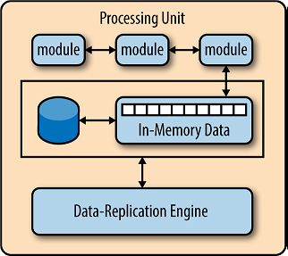
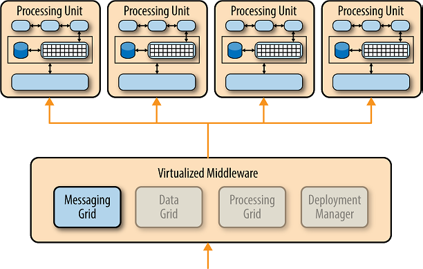
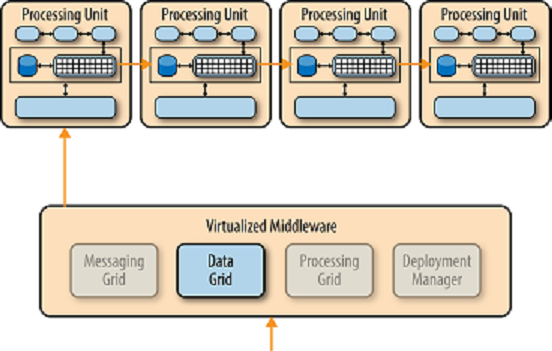
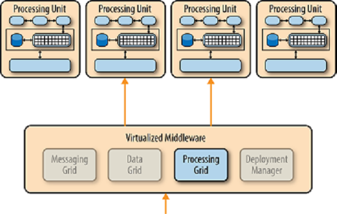

# 공간 기반 아키텍처
대부분의 웹 기반 비즈니스 애플리케이션은 동일한 일반적인 요청 흐름을 따른다. 즉, 브라우저의 요청이 웹 서버, 그 다음 애플리케이션 서버, 그리고 마지막으로 데이터베이스 서버에 도달한다. 이러한 패턴이 소수의 사용자에게는 좋은 효과가 있지만, 처음에는 웹 서버 계층에서, 그 다음에는 애플리케이션-서버 계층에서, 그리고 마지막으로 데이터베이스-서버 계층에서 사용자 부하가 증가함에 따라 병목 현상이 나타나기 시작한다. 사용자 부하 증가에 따른 병목현상에 대한 일반적인 대응은 웹 서버를 확장하는 것이다. 이것은 비교적 쉽고 저렴하며 때로는 병목현상을 해결하는 데 도움이 된다. 그러나 대부분의 사용자 부하가 높은 경우, 웹 서버 계층을 확장하면 병목 현상이 애플리케이션 서버로 옮겨질 뿐이다. 애플리케이션 서버를 확장하는 것은 웹 서버보다 더 복잡하고 비용이 많이 들 수 있으며 대개 병목 현상을 데이터베이스 서버로 옮겨 놓기만 하는데, 이는 확장하기가 훨씬 어렵고 비용이 많이 든다. 데이터베이스를 확장할 수 있다고 해도 결국 삼각형 토폴로지로 끝나는 것은 삼각형의 가장 넓은 부분은 웹 서버(가장 쉽게 확장)이고 가장 작은 부분은 데이터베이스(가장 확장하기 어려운)이다. 

동시 사용자 로드가 매우 큰 대용량 애플리케이션에서 데이터베이스는 일반적으로 동시에 처리할 수 있는 트랜잭션의 수를 제한하는 최종 요소가 될 것이다. 다양한 캐싱 기술과 데이터베이스 확장 제품이 이러한 문제를 해결하는 데 도움이 되지만, 극한 부하에 대해 정상적인 애플리케이션을 확장하는 것은 매우 어려운 제안이라는 사실은 여전히 남아 있다. 

공간 기반 아키텍처 패턴은 확장성과 동시성 문제를 다루고 해결하기 위해 특별히 설계되었다. 또한 가변적이고 예측 불가능한 동시 사용자 볼륨이 있는 애플리케이션에 유용한 아키텍처 패턴이다. 아키텍처적으로 극단적이고 가변적인 확장성 문제를 해결하는 것은 종종 데이터베이스를 스케일아웃하거나 캐싱 기술을 확장 불가능한 아키텍처로 개선하려고 시도하는 것보다 더 나은 접근법이다.

## 패턴 설명
공간 기반 패턴(클라우드 아키텍처 패턴이라고도 함)은 애플리케이션 확장을 제한하는 요소를 최소화한다. 이 패턴은 투플 공간의 개념, 분산된 공유 메모리의 개념에서 그 이름을 얻는다. 중앙 데이터베이스 제약 조건을 제거하고 대신 복제된 메모리 내 데이터 그리드를 사용하여 높은 확장성을 달성한다. 응용 프로그램 데이터는 모든 활성 처리 장치 사이에서 메모리에 저장되고 복제된다. 사용자 로드가 증가 및 감소함에 따라 처리 장치를 동적으로 시작하고 종료할 수 있으므로 가변적 확장성을 해결할 수 있다. 중앙 데이터베이스가 없기 때문에 데이터베이스 병목 현상이 제거되어 응용 프로그램 내에서 거의 무한한 확장성을 제공한다.

이 패턴에 맞는 대부분의 응용 프로그램은 브라우저에서 요청을 받고 일종의 작업을 수행하는 표준 웹 사이트이다. 입찰 경매 사이트는 이것의 좋은 예다. 이 사이트는 브라우저 요청을 통해 지속적으로 인터넷 사용자들로부터 입찰가를 받는다. 애플리케이션은 특정 품목에 대한 입찰서를 받고, 타임스탬프로 입찰 내용을 기록하고, 해당 품목에 대한 최신 입찰 정보를 업데이트하고, 정보를 브라우저로 다시 전송한다. 

이 아키텍처 패턴에는 프로세싱 유닛과 가상화된 미들웨어라는 두 가지 주요 구성요소가 있다. 그림 5-1은 기본적인 공간 기반 아키텍처 패턴과 그것의 주요 아키텍처 구성요소를 보여준다. 

처리-단위 구성요소는 애플리케이션 구성요소(또는 애플리케이션 구성요소의 일부)를 포함한다. 여기에는 백엔드 비즈니스 논리뿐만 아니라 웹 기반 구성 요소도 포함된다. 처리 장치의 내용은 애플리케이션의 유형에 따라 다르다. 작은 웹 기반 애플리케이션은 단일 프로세싱 유닛에 배치될 가능성이 있는 반면, 큰 애플리케이션은 애플리케이션의 기능 영역을 기반으로 복수의 프로세싱 유닛으로 애플리케이션 기능을 분할할 수 있다. 처리 장치는 일반적으로 메모리 내 데이터 그리드 및 페일오버를 위한 비동기 영구 저장장치(옵션)와 함께 애플리케이션 모듈을 포함한다. 

<em>그림 5-1. 공간 기반 아키텍처 패턴</em>

또한 가상화된 미들웨어가 한 처리 장치에서 수행한 데이터 변경을 다른 활성 처리 장치에 복제하는 데 사용하는 복제 엔진을 포함하고 있다. 가상화된 미들웨어 구성 요소는 하우스키핑 및 커뮤니케이션을 처리한다. 여기에는 데이터 동기화 및 처리 요청의 다양한 측면을 제어하는 구성 요소가 포함되어 있다. 가상화된 미들웨어에는 메시징 그리드, 데이터 그리드, 처리 그리드 및 구축 관리자가 포함된다. 다음 절에서 자세히 설명하는 이러한 구성요소는 맞춤 제작 또는 제3자 제품으로 구입할 수 있다.

## 패턴 역학
공간 기반 아키텍처 패턴의 마법은 각 프로세싱 유닛에 포함된 가상화된 미들웨어 구성 요소와 메모리 내 데이터 그리드에 있다. 그림 5-2는 애플리케이션 모듈, 메모리 데이터 그리드, 페일오버를 위한 비동기 지속성 저장장치(옵션) 및 데이터 복제 엔진을 포함하는 일반적인 처리 장치 아키텍처를 보여준다. 

가상화된 미들웨어는 본질적으로 아키텍처를 위한 컨트롤러로서 요청, 세션, 데이터 복제, 분산된 요청 처리 및 프로세스 단위 구축을 관리한다. 가상화된 미들웨어에는 메시징 그리드, 데이터 그리드, 처리 그리드, 구축 관리자의 네 가지 주요 아키텍처 구성 요소가 있다.

<em>그림 5-2. 프로세싱 단위 요소</em>

### 메시징 그리드
그림 5-3에 표시된 메시징 그리드는 입력 요청 및 세션 정보를 관리한다. 요청이 가상화된 미들웨어 구성 요소에 들어오면 메시징 그리드 구성 요소는 요청을 수신할 수 있는 활성 처리 구성 요소를 결정하고 요청을 해당 처리 장치 중 하나로 전달한다. 메시징 그리드의 복잡성은 단순한 라운드 로빈 알고리즘에서 보다 복잡한 차세대 가용 알고리즘에 이르기까지 다양하며, 어떤 프로세싱 유닛이 어떤 요청을 처리하고 있는지를 추적한다.

<em>그림 5-3. 메시징 그리드 요소</em>  
  
    
    

<em>그림 5-4. 데이터 그리드 요소</em>

### 데이터 그리드
데이터 그리드 구성요소는 아마도 이 패턴에서 가장 중요하고 중요한 구성요소일 것이다. 데이터 그리드는 각 처리 장치의 데이터 복제 엔진과 상호 작용하여 데이터 업데이트가 발생할 때 처리 장치 간의 데이터 복제를 관리한다. 메시징 그리드는 사용 가능한 모든 처리 장치에 요청을 전달할 수 있기 때문에, 각 처리 장치는 메모리 내 데이터 그리드에 정확히 동일한 데이터를 포함하는 것이 필수적이다. 그림 5-4는 처리 장치 간의 동기식 데이터 복제를 보여주지만, 실제로는 비동기식으로 매우 빠르게 병렬로 이루어지며, 때로는 데이터 동기화를 마이크로초(100만분의 1초)로 완료하기도 한다.

### 처리 그리드
그림 5-5에 표시된 프로세싱 그리드는 가상화된 미들웨어 내의 선택적 구성 요소로, 각각 애플리케이션 일부를 처리하는 여러 개의 프로세싱 유닛이 있을 때 분산 요청 처리를 관리한다. 처리 장치 유형(예: 주문 처리 장치와 고객 처리 장치) 간의 조정이 필요한 요청이 들어오면, 두 처리 장치 사이의 요청을 조정하고 조정하는 것은 처리 그리드다.

<em>그림 5-5. 프로세싱 그리드 요소</em>

### 구축 관리자
구축 관리자 구성 요소는 로드 조건에 따라 처리 장치의 동적 시작 및 종료를 관리한다. 이 구성요소는 지속적으로 응답 시간과 사용자 부하를 모니터링하고, 부하가 증가할 때 새로운 프로세싱 장치를 시작하고 부하가 감소할 때 프로세싱 장치를 종료한다.

## 고려 사항
공간 기반 아키텍처 패턴은 복잡하고 비용이 많이 드는 패턴이다. 부하가 가변적인 소규모 웹 기반 애플리케이션(예: 소셜 미디어 사이트, 입찰 사이트 및 경매 사이트)을 위한 좋은 아키텍처 선택이다. 그러나 운용 데이터가 많은 기존의 대규모 관계형 데이터베이스 애플리케이션에는 적합하지 않다. 
공간 기반 아키텍처 패턴에는 중앙 집중식 데이터스토어가 필요하지 않지만, 일반적으로 초기 메모리 내 데이터 그리드 로드를 수행하고 처리 장치에 의해 수행된 비동기적으로 데이터 업데이트를 지속하는 것이 포함된다. 또한 각 처리 장치 내에서 인메모리 데이터 그리드의 메모리 공간을 줄이기 위해 휘발성 및 널리 사용되는 트랜잭션 데이터를 비활성 데이터로부터 분리하는 별도의 파티션을 만드는 것이 일반적인 관행이다. 

이 패턴의 대체 이름은 클라우드 기반 아키텍처지만, 처리 장치(가상화된 미들웨어뿐만 아니라)는 클라우드 기반 호스팅 서비스나 PaaS(플랫폼 as a Service)에 상주할 필요가 없다는 점에 유의하라. 그것은 로컬 서버에 쉽게 상주할 수 있는데, 이것이 내가 "공간 기반 아키텍처"라는 이름을 선호하는 이유 중 하나이다. 

제품 구현의 관점에서는 GemFire, Java Spaces, GigaSpaces, IBM Object Grid, nCache 및 Oracle Coherence와 같은 타사 제품을 통해 이러한 패턴의 많은 아키텍처 구성요소를 구현할 수 있다. 이러한 패턴의 구현은 비용과 기능(특히 데이터 복제 시간)에 따라 크게 다르기 때문에 설계자로서 제품을 선택하기 전에 먼저 구체적인 목표와 필요성이 무엇인지 파악해야 한다.

## 패턴 분석
다음 표에는 공간 기반 아키텍처 패턴에 대한 공통 아키텍처 특성의 등급 및 분석이 수록되어 있다. 각 특징에 대한 등급은 패턴의 전형적인 구현에 기초한 능력으로서의 그 특성의 자연적 경향과 더불어 패턴이 일반적으로 알려진 것에 기초한다. 이 패턴이 이 보고서의 다른 패턴과 어떻게 관련되는지 나란히 비교하려면 이 보고서 끝에 있는 부록 A를 참조하라.

#### <em>전체적인 민첩성</em>
등급: 높음
분석: 전체적인 민첩성은 끊임없이 변화하는 환경에 신속하게 대응할 수 있는 능력이다.
처리 단위(애플리케이션의 배포된 인스턴스)를 신속하게 올리거나 내릴 수 있기 때문에, 애플리케이션은 사용자 로드의 증가나 감소와 관련된 변경(환경 변화)에 잘 대응한다. 이 패턴을 사용하여 만들어진 아키텍처들은 일반적으로 작은 애플리케이션 크기와 패턴의 동적 특성으로 인한 코딩 변경에 잘 대응한다.  

#### <em>구축 용이성</em>
등급: 높음  

분석: 일반적으로 공간 기반 아키텍처는 그렇지 않지만 디커플링 및 배포, 동적이고 정교하다. 애플리케이션을 쉽게 "밀어낼 수 있도록" 하는 클라우드 기반 툴 서버 환경으로 전환하여 구축 간소화한다.  

#### <em>시험성</em>
등급: 낮음  

분석: 테스트 환경에서 매우 높은 사용자 부하를 달성하는 것은 비용이 많이 들고 시간이 많이 소요되므로 애플리케이션의 확장성 측면을 테스트하기가 어렵다.  

#### <em>성능</em>
등급: 높음  

분석: 메모리 내 데이터 액세스 및 캐싱 메커니즘을 통해 높은 성능을 달성할 수 있다.  

#### <em>확장성</em> 
등급: 높음  

분석: 높은 확장성은 중앙집중형 데이터베이스에 대한 의존성이 거의 없거나 전혀 없다는 사실에서 비롯되며, 따라서 기본적으로 확장 방정식에서 이러한 제한 병목 현상을 제거한다.  

#### <em>개발 용이성</em>
등급: 낮음  

분석: 정교한 캐싱과 인메모리 데이터 그리드 제품은 이러한 패턴을 상대적으로 개발하기가 복잡하며, 주로 이러한 유형의 아키텍처를 만드는 데 사용되는 도구와 제품에 익숙하지 않기 때문이다. 또한, 이러한 유형의 아키텍처를 개발하는 동안 소스 코드의 어떤 것도 성능과 확장성에 영향을 미치지 않도록 각별히 주의해야 한다.

